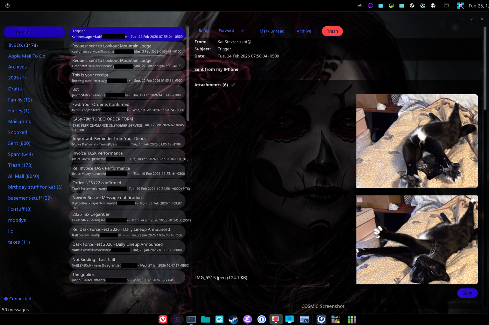

<p align="center">
  
</p>

# Nevermail

A COSMIC desktop email client for Linux, built in Rust.

Built for users who prefer native, privacy-respecting desktop software over webmail.

**Status:** Alpha — single-account IMAP client with compose, search, threading, drag-and-drop, and HTML rendering. Daily-driveable on standard IMAP providers.

<p align="center">
  
</p>

## Features

- **Three-pane layout** — folder sidebar, message list, preview pane
- **SQLite cache** — offline browsing, fast pagination, full-text search (FTS5)
- **Threading** — computed from `Message-ID`/`In-Reply-To`/`References`, collapsible in the list
- **HTML mail** — sanitized HTML → markdown → native rich text (no embedded web engine)
- **Compose / reply / forward** — with attachments, multiple From addresses, quoted text
- **Drag and drop** — attach files to compose, move messages between folders
- **Flags & actions** — read/unread, star, archive, trash with optimistic UI
- **IMAP IDLE** — real-time push notifications for new mail
- **Keyboard driven** — vim-style navigation (j/k), action shortcuts, search with `/`
- **OS keyring** — credentials stored in gnome-keyring/libsecret, setup dialog on first run
- **Desktop notifications** — notify on new mail arrival

## Stack

| Layer       | Crate                                                       | Role                                      |
|-------------|-------------------------------------------------------------|-------------------------------------------|
| UI          | [libcosmic](https://github.com/pop-os/libcosmic)            | COSMIC desktop toolkit (iced fork)        |
| Mail engine | [melib](https://crates.io/crates/melib)                     | IMAP, MIME parsing, envelope handling     |
| SMTP        | [lettre](https://crates.io/crates/lettre)                   | Outbound mail delivery                    |
| HTML render | [html-safe-md](html-safe-md/) (local crate)                 | Sanitize + convert HTML → markdown        |
| Plaintext   | [html2text](https://crates.io/crates/html2text) (via above) | Plain-text fallback for quoting and FTS   |
| Cache       | [rusqlite](https://crates.io/crates/rusqlite)               | Local SQLite message cache + FTS5         |
| Credentials | [keyring](https://crates.io/crates/keyring)                 | OS keyring (libsecret/gnome-keyring)      |
| DnD portals | [ashpd](https://crates.io/crates/ashpd)                     | Wayland xdg-portal file transfer          |
| Async       | [tokio](https://crates.io/crates/tokio)                     | Async runtime                             |

## Architecture

```
src/
├── main.rs                    Entry point, env_logger init
├── config.rs                  Config resolution (env → file + keyring → setup dialog)
├── app/
│   ├── mod.rs                 AppModel, Message enum, COSMIC trait impl, dispatcher
│   ├── actions.rs             Flag/move handlers (read, star, trash, archive)
│   ├── body.rs                Body/attachment viewing
│   ├── compose.rs             Compose handlers + quote/forward helpers
│   ├── navigation.rs          Keyboard nav, visibility filtering
│   ├── search.rs              Full-text search handlers
│   ├── setup.rs               Setup dialog handlers + view
│   ├── sync.rs                Connection, sync, folder handlers
│   └── watch.rs               IMAP IDLE watch stream + event handlers
├── core/
│   ├── imap.rs                ImapSession: connect, fetch, flags, move, watch
│   ├── mime.rs                Body rendering, HTML sanitization, link handling
│   ├── smtp.rs                SMTP send via lettre
│   ├── keyring.rs             OS keyring backend
│   ├── models.rs              Folder, MessageSummary, AttachmentData
│   └── store/
│       ├── schema.rs          DDL, forward-only migrations, FTS5 setup
│       ├── flags.rs           Compact flag encoding (2-bit per flag)
│       ├── commands.rs        CacheCmd enum (channel message types)
│       ├── queries.rs         All SQL query functions
│       └── handle.rs          CacheHandle async facade + background thread
└── ui/
    ├── sidebar.rs             Folder list + connection status
    ├── message_list.rs        Message headers + search bar
    ├── message_view.rs        Message body preview pane
    └── compose_dialog.rs      Compose/reply/forward dialog
```

The app follows the COSMIC MVU (Model-View-Update) pattern:
- **Model**: `AppModel` holds all state (folders, messages, selection, sync status)
- **View**: Three-pane layout (sidebar | message list | message preview)
- **Update**: `Message` enum drives all state transitions — UI widgets never call core directly

Data flows: IMAP (via melib) → domain models → SQLite cache → COSMIC widgets.

### Design principles

- **Cache is the UI source of truth.** The list renders from SQLite, not from live IMAP state. Background sync updates the cache, then the UI refreshes.
- **Optimistic UI with reconciliation.** Flag toggles and moves update the UI immediately, write to cache, then enqueue the IMAP operation. Conflicts reconcile on the next sync.
- **`core/` stays UI-independent.** No COSMIC types leak into the mail engine.
- **Credentials resolve gracefully.** Env vars override everything. Config file + keyring is the default. Missing credentials show a setup dialog — no panics.

### HTML rendering: no web engine

Most email today is HTML. Most email clients embed a full web engine (WebKit, Chromium, Gecko) to render it. Nevermail doesn't.

HTML email is a surveillance vector. Tracking pixels, remote image loads, JavaScript, and CSS callbacks all phone home to tell senders when, where, and on what device you opened their message. An embedded browser makes all of that work by default. Turning it off becomes a game of whack-a-mole against an engine designed to fetch remote resources.

Nevermail sidesteps this entirely. The rendering pipeline is:

1. **html-safe-md** (a local crate wrapping ammonia + html2md) strips everything that isn't content — scripts, iframes, tracking pixels, remote images, event handlers, `<style>` blocks with external references — then converts the surviving HTML structure into markdown (headings, lists, links, emphasis)
2. **iced's markdown widget** renders that as native rich text

The result is that you see the message. Formatted text, links, structure — all there. What you don't get is pixel-perfect newsletter layouts, and what senders don't get is a read receipt. That's the trade.

For plain-text quoting and full-text search indexing, **html-safe-md** also provides a plain-text conversion path (via html2text) that stays fully local.

## Keyboard shortcuts

| Key       | Action                    |
|-----------|---------------------------|
| `j` / `↓` | Next message              |
| `k` / `↑` | Previous message          |
| `Enter`   | Open selected message     |
| `Space`   | Collapse/expand thread    |
| `/`       | Focus search              |
| `Escape`  | Clear search              |
| `c`       | Compose new message       |
| `r`       | Reply to selected message |
| `f`       | Forward selected message  |

Message actions (buttons in preview pane): toggle read, toggle star, archive, trash, copy body, save attachment.

The **connection status pill** at the bottom of the sidebar shows current IMAP state (Connected / Syncing / Offline). Click to force a reconnect.

## Building

Requires Rust nightly and system dependencies for libcosmic (Wayland dev libraries).

```sh
cargo build            # debug (large, ~600M+ — normal for wgpu debug builds)
cargo build --release  # release (~44M)
```

## Configuration

On first run, a setup dialog prompts for IMAP server, username, and password. Credentials are stored in the OS keyring (gnome-keyring/libsecret) with a config file at `~/.config/nevermail/config.json`.

Environment variables override everything (useful for development/testing):

```sh
export NEVERMAIL_SERVER=mail.runbox.com
export NEVERMAIL_PORT=993
export NEVERMAIL_USER=you@runbox.com
export NEVERMAIL_PASSWORD=yourpassword
export NEVERMAIL_STARTTLS=false
```

## Not yet supported

- Multiple accounts
- OAuth2 (see below)

### A note on OAuth2 and Gmail

Nevermail uses password authentication. Gmail requires a **restricted OAuth2 scope** (`https://mail.google.com/`) for IMAP access, which means a third-party security audit, annual re-verification, and a process designed for companies — not indie projects.

Nevermail targets standard IMAP providers (Runbox, Fastmail, Migadu, self-hosted, etc.) that work with normal credentials. The Rust ecosystem has the plumbing ([`oauth2-rs`](https://github.com/ramosbugs/oauth2-rs), melib's XOAUTH2 support) if it ever makes sense to pursue.

## License

GPL-3.0-or-later
