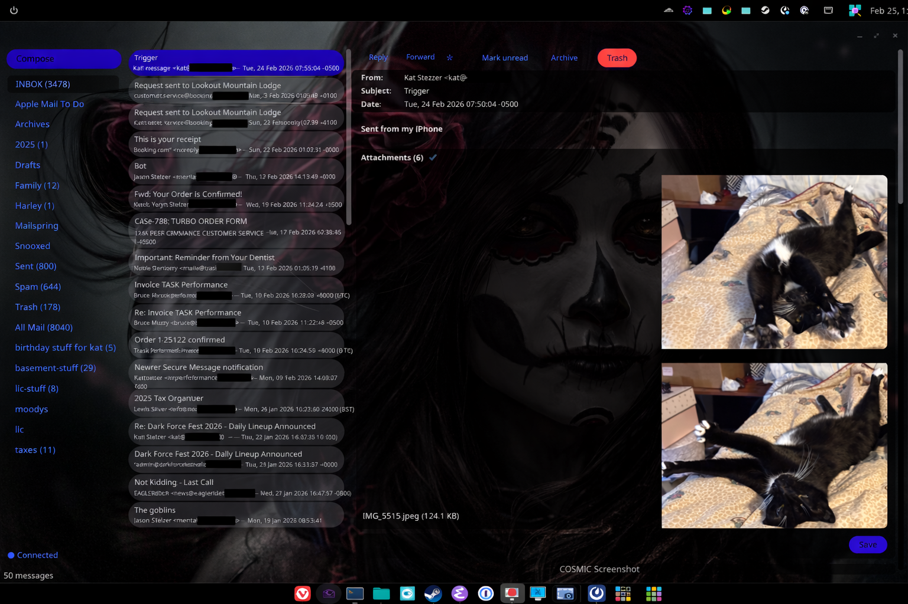

<p align="center">
  
</p>

# Neverlight Mail

A COSMIC desktop email client for Linux, built in Rust.

Built for users who prefer native, privacy-respecting desktop software over webmail.

**Status:** Alpha — JMAP-native client with compose, search, threading, drag-and-drop, and HTML rendering. Daily-driveable on JMAP providers (Fastmail validated).

<p align="center">
  
</p>

## Features

- **Three-pane layout** — folder sidebar, message list, preview pane
- **JMAP-native** — built on RFC 8620/8621, no IMAP/SMTP translation layer
- **SQLite cache** — offline browsing, fast pagination, full-text search (FTS5)
- **Threading** — JMAP thread IDs, collapsible in the list
- **HTML mail** — sanitized HTML → markdown → native rich text (no embedded web engine)
- **Compose / reply / forward** — with attachments, multiple From addresses, quoted text
- **Drag and drop** — attach files to compose, move messages between folders
- **Flags & actions** — read/unread, star, archive, trash with optimistic UI
- **JMAP EventSource** — real-time push notifications via SSE (replaces IMAP IDLE)
- **Keyboard driven** — vim-style navigation (j/k), action shortcuts, search with `/`
- **OS keyring** — credentials stored in gnome-keyring/libsecret, setup dialog on first run
- **Desktop notifications** — notify on new mail arrival
- **OAuth 2.0** — via [neverlight-mail-oauth](https://github.com/jstelzer/neverlight-mail-oauth) for providers that require it

## Stack

| Layer       | Crate                                                                      | Role                                              |
|-------------|----------------------------------------------------------------------------|---------------------------------------------------|
| UI          | [libcosmic](https://github.com/pop-os/libcosmic)                           | COSMIC desktop toolkit (iced fork)                |
| Mail engine | [neverlight-mail-core](../neverlight-mail-core)                            | JMAP client, MIME parsing, cache                  |
| OAuth       | [neverlight-mail-oauth](https://github.com/jstelzer/neverlight-mail-oauth) | OAuth 2.0 (RFC draft-ietf-mailmaint-oauth-public) |
| HTML render | [html-safe-md](../html-safe-md)                                            | Sanitize + convert HTML → markdown                |
| Sending     | JMAP `EmailSubmission/set`                                                 | Outbound mail via JMAP (no SMTP)                  |
| Push        | JMAP EventSource (SSE)                                                     | Real-time notifications (no IMAP IDLE)            |
| Cache       | [rusqlite](https://crates.io/crates/rusqlite)                              | Local SQLite message cache + FTS5                 |
| Credentials | [keyring](https://crates.io/crates/keyring)                                | OS keyring (libsecret/gnome-keyring)              |
| DnD portals | [ashpd](https://crates.io/crates/ashpd)                                    | Wayland xdg-portal file transfer                  |
| Async       | [tokio](https://crates.io/crates/tokio)                                    | Async runtime                                     |

## Architecture

```
neverlight-mail-core/               Headless JMAP engine (zero COSMIC deps)
├── src/
│   ├── client.rs                   JmapClient: HTTP transport, request batching
│   ├── session.rs                  JMAP session discovery, capability negotiation
│   ├── config.rs                   Config resolution (env → file+keyring → setup)
│   ├── email.rs                    Email/query, Email/get, Email/set
│   ├── mailbox.rs                  Mailbox/get, find_by_role
│   ├── submit.rs                   EmailSubmission/set (replaces SMTP)
│   ├── push.rs                     EventSource SSE (replaces IMAP IDLE)
│   ├── parse.rs                    RFC 5322 body extraction via mail-parser
│   ├── mime.rs                     render_body, render_body_markdown, open_link
│   ├── keyring.rs                  OS keyring credential backend
│   ├── models.rs                   Folder, MessageSummary, AttachmentData
│   ├── setup.rs                    UI-agnostic setup state machine
│   └── store/                      SQLite cache (schema, flags, queries, handle)

neverlight-mail/                    COSMIC desktop GUI
├── src/
│   ├── main.rs                     Entry point, env_logger init
│   ├── app/
│   │   ├── mod.rs                  AppModel, Message enum, COSMIC trait impl, dispatcher
│   │   ├── actions.rs              Flag/move handlers (read, star, trash, archive)
│   │   ├── body.rs                 Body/attachment viewing
│   │   ├── compose.rs              Compose handlers + quote/forward helpers
│   │   ├── navigation.rs           Keyboard nav, visibility filtering
│   │   ├── search.rs               Full-text search handlers
│   │   ├── setup.rs                Setup dialog handlers + view
│   │   ├── sync.rs                 Connection, sync, folder handlers
│   │   └── watch.rs                JMAP EventSource watch stream + event handlers
│   └── ui/
│       ├── sidebar.rs              Folder list + diagnostics panel
│       ├── message_list.rs         Message headers + search bar
│       ├── message_view.rs         Message body preview pane
│       └── compose_dialog.rs       Compose/reply/forward dialog
```

The app follows the COSMIC MVU (Model-View-Update) pattern:
- **Model**: `AppModel` holds all state (folders, messages, selection, sync status)
- **View**: Three-pane layout (sidebar | message list | message preview)
- **Update**: `Message` enum drives all state transitions — UI widgets never call core directly

Data flows: JMAP (via neverlight-mail-core) → domain models → SQLite cache → COSMIC widgets.

### Design principles

- **Cache is the UI source of truth.** The list renders from SQLite, not from live JMAP state. Background sync updates the cache, then the UI refreshes.
- **Optimistic UI with reconciliation.** Flag toggles and moves update the UI immediately, write to cache, then enqueue the JMAP operation. Failures roll back.
- **Core stays UI-independent.** No COSMIC types leak into the mail engine.
- **Credentials resolve gracefully.** Env vars override everything. Config file + keyring is the default. Missing credentials show a setup dialog — no panics.

### HTML rendering: no web engine

Most email today is HTML. Most email clients embed a full web engine (WebKit, Chromium, Gecko) to render it. Neverlight Mail doesn't.

HTML email is a surveillance vector. Tracking pixels, remote image loads, JavaScript, and CSS callbacks all phone home to tell senders when, where, and on what device you opened their message. An embedded browser makes all of that work by default. Turning it off becomes a game of whack-a-mole against an engine designed to fetch remote resources.

Neverlight Mail sidesteps this entirely:

1. HTML is sanitized (scripts, iframes, tracking pixels, remote images stripped) and converted to markdown
2. **iced's markdown widget** renders that as native rich text

You see the message — formatted text, links, structure. What you don't get is pixel-perfect newsletter layouts, and what senders don't get is a read receipt.

## Keyboard shortcuts

| Key       | Action                    |
|-----------|---------------------------|
| `j` / `↓` | Next message              |
| `k` / `↑` | Previous message          |
| `Enter`   | Open selected message     |
| `Space`   | Collapse/expand thread    |
| `/`       | Focus search              |
| `Escape`  | Clear search              |
| `c`       | Compose new message       |
| `r`       | Reply to selected message |
| `f`       | Forward selected message  |

Message actions (buttons in preview pane): toggle read, toggle star, archive, trash, copy body, save attachment.

The **connection status pill** at the bottom of the sidebar shows current JMAP state (Connected / Syncing / Error). Click to force a reconnect.

## Building

Requires Rust nightly and system dependencies for libcosmic (Wayland dev libraries).

```sh
cargo build            # debug (large, ~600M+ — normal for wgpu debug builds)
cargo build --release  # release (~44M)
```

## Configuration

On first run, a setup dialog prompts for JMAP session URL, username, and token (app password). Credentials are stored in the OS keyring (gnome-keyring/libsecret) with a config file at `~/.config/neverlight-mail/config.json`.

For providers that support OAuth 2.0, authentication is handled by [neverlight-mail-oauth](https://github.com/jstelzer/neverlight-mail-oauth), which implements the draft-ietf-mailmaint-oauth-public spec for native public clients.

Environment variables override everything (useful for development/testing):

```sh
export NEVERLIGHT_JMAP_URL=https://api.fastmail.com/jmap/session
export NEVERLIGHT_JMAP_USER=you@fastmail.com
export NEVERLIGHT_JMAP_TOKEN=your-app-password
```

## Known Limitations

- **Fastmail validated only** — other JMAP providers should work but are untested
- **No mailbox management** — create/rename/delete mailboxes not supported
- **No offline compose** — requires active JMAP client for identity resolution and submission

## License

MIT OR Apache-2.0
